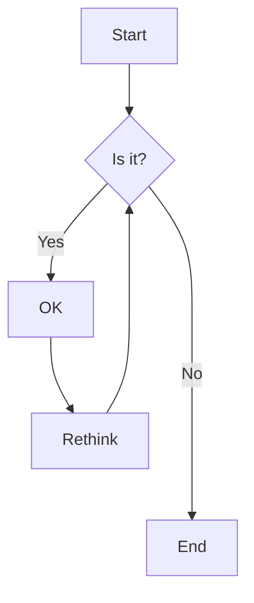
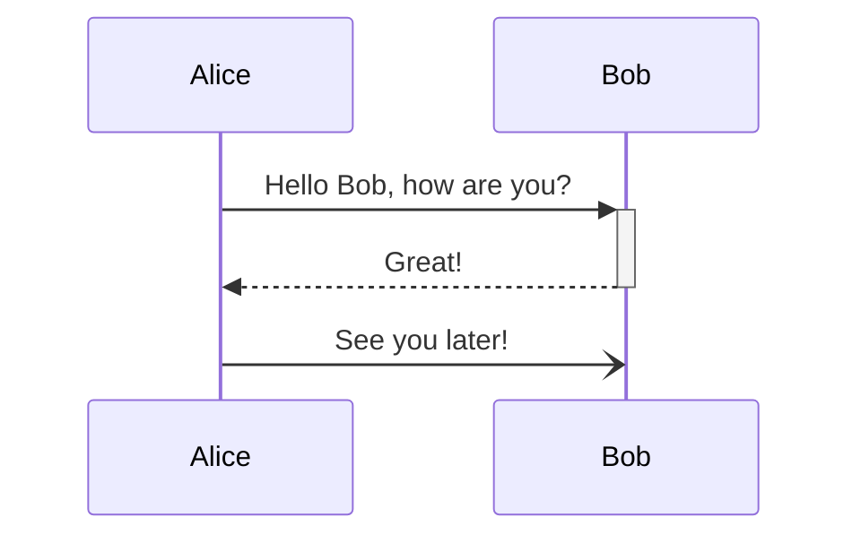
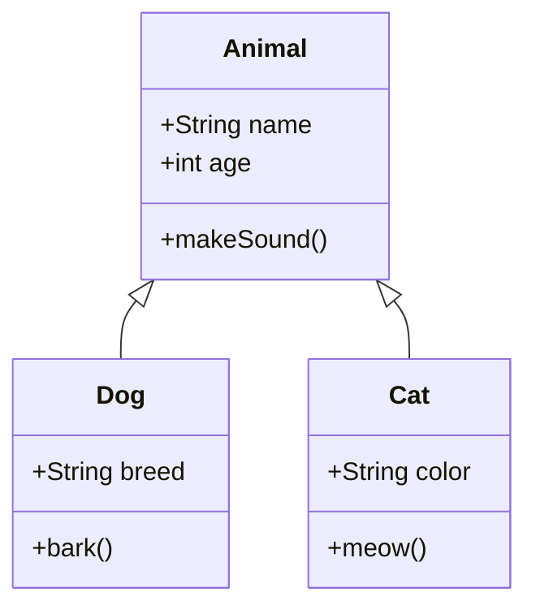

# MarkDD Editor v1.1 - Complete Feature Showcase

**Version 1.1** - Advanced Markdown Editor with Full Feature Set

This document demonstrates all features available in MarkDD Editor v1.1.

## Table of Contents
[TOC]

---

## ✨ What's New in Version 1.1

### Recent Improvements & Fixes
- ✅ **Custom Container Blocks** - Full support for `:::info`, `:::warning`, `:::danger`, `:::tip`, `:::note` blocks with optional titles
- ✅ **Draggable Search & Replace** - Non-blocking, movable find & replace window (Ctrl+F) that doesn't gray out the editor
- ✅ **Manual Refresh Control** - Toggle live preview on/off with dedicated manual refresh button (Ctrl+R) when live preview is disabled
- ✅ **KityMinder Editing** - Full editing capability restored for saved mind maps (click ✏️ Edit button)
- ✅ **Clean Exports** - HTML and PDF exports no longer include interactive buttons or "View JSON" / "Edit" controls
- ✅ **Image Plugin** - Automatic responsive images with lazy loading and figure captions
- ✅ **Video Plugin** - YouTube links automatically convert to embedded videos (tested with https://youtu.be/5Peo-ivmupE)

---

## 🎨 Custom Container Blocks

Create beautifully styled information blocks:

:::info Important Information
This is an informational block with a custom title. Perfect for highlighting key points!
:::

:::warning Watch Out
Warning blocks help alert users to potential issues.
:::

:::danger Critical
Danger blocks indicate critical warnings that need immediate attention.
:::

:::tip Pro Tip
Share helpful hints and best practices with your readers.
:::

:::note Additional Context
Notes provide supplementary information without disrupting flow.
:::

---

## 🔍 Enhanced Search & Replace
Press **Ctrl+F** to open the search modal:
- **Draggable Window** - Click and drag the header to reposition anywhere on screen
- **Non-Blocking** - Editor stays fully visible and editable while searching
- **Full Features** - Find, Replace, Replace All with case-sensitive and regex options
- **Live Highlighting** - Search results highlight as you type

---

## 🖼️ Image & Video Plugins

### Images with Lazy Loading
Images are automatically optimized:


Features:
- Automatic `loading="lazy"` attribute
- Responsive sizing with `max-width: 100%`
- Figure captions from alt text
- Proper semantic HTML structure

### YouTube Video Embedding
Paste any YouTube link and it auto-embeds:

**Example:** https://youtu.be/5Peo-ivmupE?si=TlIfjpTxXMlWq8wv

The video appears as a fully functional embedded player with all YouTube controls.

---

## Mathematical Expressions

### Inline Math
Here's some inline math: $E = mc^2$ and $\sum_{i=1}^{n} i = \frac{n(n+1)}{2}$.

### Display Math Blocks
$$
\int_{-\infty}^{\infty} e^{-x^2} dx = \sqrt{\pi}
$$

### Math Code Blocks
```math
\begin{align}
\nabla \times \vec{\mathbf{B}} -\, \frac1c\, \frac{\partial\vec{\mathbf{E}}}{\partial t} &= \frac{4\pi}{c}\vec{\mathbf{j}} \\
\nabla \cdot \vec{\mathbf{E}} &= 4 \pi \rho \\
\nabla \times \vec{\mathbf{E}}\, +\, \frac1c\, \frac{\partial\vec{\mathbf{B}}}{\partial t} &= \vec{\mathbf{0}} \\
\nabla \cdot \vec{\mathbf{B}} &= 0
\end{align}
```

## LaTeX Document Rendering

### Simple LaTeX Document
```latex
\documentclass{article}
\usepackage[utf8]{inputenc}
\usepackage{amsmath}

\title{LaTeX Document in MarkDD}
\author{MarkDD Editor}
\date{\today}

\begin{document}

\maketitle

\section{Introduction}

This is a complete LaTeX document rendered using LaTeX.js within the MarkDD Editor. It demonstrates the ability to render full LaTeX documents, not just mathematical expressions.

\section{Mathematical Examples}

The quadratic formula is given by:
\begin{equation}
x = \frac{-b \pm \sqrt{b^2 - 4ac}}{2a}
\end{equation}

We can also display matrices:
\begin{equation}
\mathbf{A} = \begin{pmatrix}
a_{11} & a_{12} & \cdots & a_{1n} \\
a_{21} & a_{22} & \cdots & a_{2n} \\
\vdots & \vdots & \ddots & \vdots \\
a_{m1} & a_{m2} & \cdots & a_{mn}
\end{pmatrix}
\end{equation}

\section{Lists and Formatting}

\subsection{Enumerated List}
\begin{enumerate}
    \item First item
    \item Second item with \textbf{bold} text
    \item Third item with \textit{italic} text
    \item Fourth item with \texttt{monospace} text
\end{enumerate}

\subsection{Itemized List}
\begin{itemize}
    \item Bullet point one
    \item Bullet point two
    \item Bullet point three
\end{itemize}

\section{Tables}

\begin{table}[h]
\centering
\begin{tabular}{|c|c|c|}
\hline
Column 1 & Column 2 & Column 3 \\
\hline
A & B & C \\
D & E & F \\
G & H & I \\
\hline
\end{tabular}
\caption{Example Table}
\end{table}

\section{Conclusion}

This demonstrates the power of integrating LaTeX.js into MarkDD Editor, allowing for complete LaTeX document rendering alongside markdown content.

\end{document}
```

### Advanced LaTeX with Custom Commands
```latex
\documentclass{article}
\usepackage{amsmath}
\usepackage{amssymb}

% Custom commands
\newcommand{\R}{\mathbb{R}}
\newcommand{\C}{\mathbb{C}}
\newcommand{\norm}[1]{\left\lVert#1\right\rVert}

\begin{document}

\title{Advanced LaTeX Features}
\maketitle

\section{Custom Commands}

Let $f: \R \to \C$ be a function. We can define the norm as $\norm{f}$.

\section{Complex Equations}

The Cauchy-Schwarz inequality:
\begin{equation}
\left| \sum_{i=1}^n x_i y_i \right|^2 \leq \left( \sum_{i=1}^n x_i^2 \right) \left( \sum_{i=1}^n y_i^2 \right)
\end{equation}

\section{Theorem Environment}

\textbf{Theorem 1.} For any real numbers $a$ and $b$:
\begin{equation}
(a + b)^2 = a^2 + 2ab + b^2
\end{equation}

\textbf{Proof.} This follows directly from algebraic expansion.

\end{document}
```

## Mermaid Diagrams

### Flowchart


### Sequence Diagram


### Class Diagram


## TikZ and CircuiTikZ Diagrams

### Basic TikZ
```tikz
\begin{tikzpicture}
\draw[thick,->] (0,0) -- (4.5,0) node[anchor=north west] {x axis};
\draw[thick,->] (0,0) -- (0,4.5) node[anchor=south east] {y axis};
\foreach \x in {0,1,2,3,4}
   \draw (\x cm,1pt) -- (\x cm,-1pt) node[anchor=north] {$\x$};
\foreach \y in {0,1,2,3,4}
    \draw (1pt,\y cm) -- (-1pt,\y cm) node[anchor=east] {$\y$};
\draw[blue] plot[smooth] coordinates {(0,0) (1,1) (2,4) (3,2) (4,3)};
\end{tikzpicture}
```

### CircuiTikZ Circuit
```circuitikz
\begin{circuitikz}
\draw (0,0) to[battery1, l=$V_s$] (0,3)
      to[R, l=$R_1$] (3,3)
      to[L, l=$L$] (3,0)
      to[short] (0,0);
\draw (3,3) to[C, l=$C$] (6,3)
      to[R, l=$R_2$] (6,0)
      to[short] (3,0);
\end{circuitikz}
```

## Code Blocks with Syntax Highlighting

### Python
```python
def fibonacci(n):
    """Generate Fibonacci sequence up to n terms."""
    if n <= 0:
        return []
    elif n == 1:
        return [0]
    elif n == 2:
        return [0, 1]
    
    fib_sequence = [0, 1]
    for i in range(2, n):
        fib_sequence.append(fib_sequence[i-1] + fib_sequence[i-2])
    
    return fib_sequence

# Example usage
print(fibonacci(10))
```

### JavaScript
```javascript
class MarkdownEditor {
    constructor(container) {
        this.container = container;
        this.plugins = new Map();
    }
    
    registerPlugin(name, plugin) {
        this.plugins.set(name, plugin);
        console.log(`Plugin ${name} registered`);
    }
    
    render(markdown) {
        let html = this.parseMarkdown(markdown);
        
        // Apply plugins
        for (const [name, plugin] of this.plugins) {
            html = plugin.process(html);
        }
        
        return html;
    }
}
```

### TypeScript
```typescript
interface Plugin {
    name: string;
    version: string;
    process(content: string): string;
}

class PluginManager {
    private plugins: Map<string, Plugin> = new Map();
    
    public install(plugin: Plugin): boolean {
        try {
            this.plugins.set(plugin.name, plugin);
            return true;
        } catch (error) {
            console.error(`Failed to install plugin ${plugin.name}:`, error);
            return false;
        }
    }
    
    public getPlugin(name: string): Plugin | undefined {
        return this.plugins.get(name);
    }
}
```


## Tables

### Simple Table
| Feature | Status | Description |
|---------|--------|-------------|
| Markdown Editing | ✅ Complete | Full-featured editor |
| Live Preview | ✅ Complete | Real-time rendering |
| LaTeX.js | ✅ Complete | Full document support |
| Plugin System | ✅ Complete | Extensible architecture |
| Export | ✅ Complete | Multiple formats |

### Advanced Table with Math
| Formula | Name | Application |
|---------|------|-------------|
| $E = mc^2$ | Mass-Energy Equivalence | Relativity |
| $F = ma$ | Newton's Second Law | Mechanics |
| $V = IR$ | Ohm's Law | Electronics |
| $\int_{a}^{b} f(x)dx$ | Definite Integral | Calculus |

## Task Lists

### Basic Tasks
- [x] Implement LaTeX.js integration
- [x] Add plugin installation system
- [x] Create comprehensive test file
- [ ] Add more diagram types
- [ ] Implement collaborative editing

### Advanced Tasks
- [x] **Core Features**
  - [x] Markdown editing
  - [x] Live preview
  - [x] Syntax highlighting
- [x] **Diagram Support**
  - [x] Mermaid diagrams
  - [x] TikZ/CircuiTikZ
  - [x] Mathematical expressions
  - [x] LaTeX documents
- [ ] **Future Enhancements**
  - [ ] Real-time collaboration
  - [ ] Cloud synchronization
  - [ ] Mobile app

## Custom Blocks

:::info Information Block
This is an information block that provides additional context or details about the content.
:::

:::warning Warning Block
This is a warning block that alerts users to important considerations or potential issues.
:::

:::error Error Block
This is an error block that indicates critical problems or failures that need attention.
:::

:::success Success Block
This is a success block that confirms successful operations or positive outcomes.
:::

## Advanced Markdown Features

### Abbreviations
*[HTML]: Hyper Text Markup Language
*[W3C]: World Wide Web Consortium

The HTML specification is maintained by the W3C.

### Footnotes
This text has a footnote[^1]. Here's another one[^2].

[^1]: This is the first footnote.
[^2]: This is the second footnote with more details.

### Keyboard Keys
Press [[Ctrl]]+[[C]] to copy and [[Ctrl]]+[[V]] to paste.

### Subscript and Superscript
H~2~O is water, and E = mc^2^ is Einstein's formula.

### Spoilers
This contains a spoiler: ||The butler did it||.


## Mathematical Proofs and Formal Documents

### Example Proof in LaTeX
```latex
\documentclass{article}
\usepackage{amsmath}
\usepackage{amsthm}

\newtheorem{theorem}{Theorem}
\newtheorem{proof}{Proof}

\begin{document}

\begin{theorem}
The sum of the first $n$ positive integers is $\frac{n(n+1)}{2}$.
\end{theorem}

\begin{proof}
We prove this by mathematical induction.

\textbf{Base case:} For $n = 1$, we have $1 = \frac{1(1+1)}{2} = 1$. ✓

\textbf{Inductive step:} Assume the formula holds for some $k \geq 1$:
$$\sum_{i=1}^{k} i = \frac{k(k+1)}{2}$$

We need to show it holds for $k+1$:
\begin{align}
\sum_{i=1}^{k+1} i &= \sum_{i=1}^{k} i + (k+1) \\
&= \frac{k(k+1)}{2} + (k+1) \\
&= \frac{k(k+1) + 2(k+1)}{2} \\
&= \frac{(k+1)(k+2)}{2}
\end{align}

Therefore, by mathematical induction, the formula holds for all positive integers $n$.
\end{proof}

\end{document}
```

## Plugin Installation Test

The MarkDD Editor now includes a comprehensive plugin installation system that allows you to:

1. **Browse Available Plugins** - View all compatible plugins
2. **Install Plugins** - Install plugins directly from the interface
3. **Manage Plugins** - Enable/disable and uninstall plugins
4. **Plugin Status** - Real-time installation status updates

### Available Plugin Categories:
- **Diagram Renderers** - TikZ, Mermaid, PlantUML extensions
- **Mathematical Tools** - Enhanced LaTeX, equation editors
- **Export Utilities** - PDF, Word, presentation converters
- **Editor Enhancements** - Themes, shortcuts, productivity tools
- **Collaboration Tools** - Real-time editing, comments, reviews

Access the plugin manager through the **Tools > Manage Plugins** menu.

## Performance and Rendering Test

This document tests various rendering performance aspects:

- **Large documents** with multiple diagram types
- **Complex mathematical expressions** with nested formulas
- **Mixed content types** (markdown + LaTeX + diagrams)
- **Responsive design** across different screen sizes
- **Export compatibility** for various output formats
