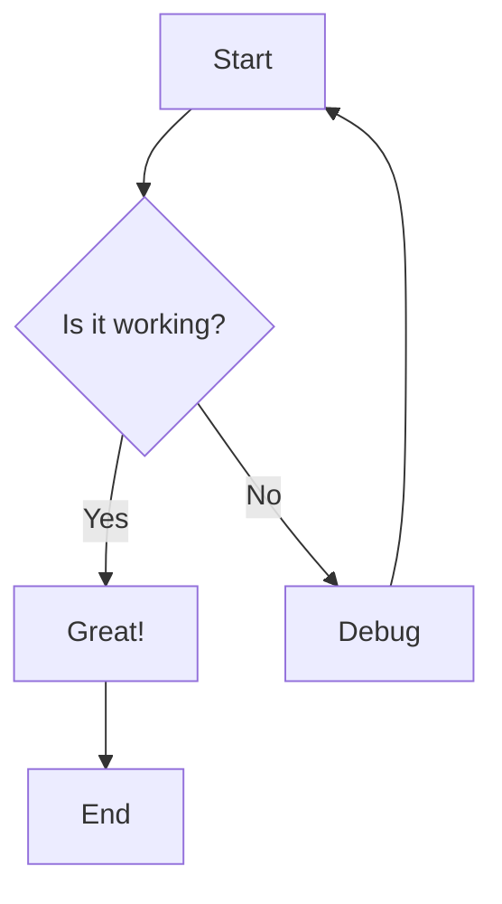
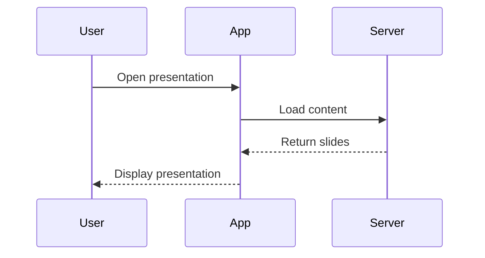
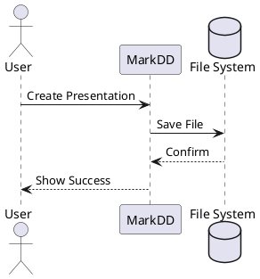

# Title Slide

Welcome to the Complete Feature Test

Testing all presentation capabilities

---

# Features Overview

## What We'll Test

- Slide transitions (fade, slide, zoom)
- Navigation (left, top, none)
- Table of Contents generation
- PDF export
- Mathematical expressions
- Diagrams (Mermaid, PlantUML)
- Code highlighting
- Headers and footers

---

## Mathematical Expressions

### Inline Math

Einstein's famous equation: $E = mc^2$

Quadratic formula: $x = \frac{-b \pm \sqrt{b^2 - 4ac}}{2a}$

### Display Math

$$
\int_{-\infty}^{\infty} e^{-x^2} dx = \sqrt{\pi}
$$

$$
\nabla \times \vec{E} = -\frac{\partial \vec{B}}{\partial t}
$$

---

## Code Highlighting

### Python Example

```python
def fibonacci(n):
    """Generate Fibonacci sequence"""
    a, b = 0, 1
    for _ in range(n):
        yield a
        a, b = b, a + b

# Print first 10 numbers
for num in fibonacci(10):
    print(num)
```

### JavaScript Example

```javascript
const greet = (name) => {
    return `Hello, ${name}!`;
};

console.log(greet('World'));
```

---

## Mermaid Diagrams

### Simple Flowchart



---

## Mermaid Sequence Diagram



---

## Lists and Formatting

### Unordered Lists

- First level item
  - Second level item
  - Another second level
    - Third level item
- Back to first level

### Ordered Lists

1. Step one
2. Step two
3. Step three
   1. Sub-step A
   2. Sub-step B
4. Step four

---

## Text Formatting

**Bold text** for emphasis

*Italic text* for style

***Bold and italic*** together

`Inline code` for technical terms

> Blockquote for important notes
> Spanning multiple lines

---

## Tables

| Feature | Status | Priority |
|---------|--------|----------|
| Transitions | Testing | High |
| TOC | Testing | High |
| PDF Export | Testing | High |
| Navigation | Testing | Medium |

---

## PlantUML Diagram



---

## Links and Images

### External Link

Visit [MarkDD Documentation](https://github.com)

### Email Link

Contact: [support@example.com](mailto:support@example.com)

---

## Chemistry (if supported)

Chemical equation:

$$\ce{CO2 + C -> 2 CO}$$

$$\ce{H2SO4 + 2NaOH -> Na2SO4 + 2H2O}$$

---

## Navigation Test Slide 1

This slide tests the navigation system.

Try:
- Click on TOC items (left sidebar)
- Use arrow keys
- Click left/right side of slide
- Use Home/End keys

---

## Navigation Test Slide 2

### Keyboard Shortcuts

- `→` or `Space`: Next slide
- `←`: Previous slide
- `Home`: First slide
- `End`: Last slide

---

## Transition Test Slide 1

This slide should **fade** into view.

Check the front-matter for transition settings:
- `transition: fade`
- `transitionDuration: 600`

---

## Transition Test Slide 2

The transition should be smooth and consistent.

Notice the opacity changes between slides.

---

## Transition Test Slide 3

Testing continues...

All slides should transition uniformly.

---

## Long Content Test

### Testing Overflow

1. First item with some text
2. Second item with more text
3. Third item with even more text to test wrapping
4. Fourth item
5. Fifth item
6. Sixth item
7. Seventh item
8. Eighth item
9. Ninth item
10. Tenth item

The slide should scroll if content exceeds viewport.

---

## PDF Export Test

This slide tests PDF generation:

✓ All slides should appear in PDF
✓ Math should be rendered
✓ Diagrams should be visible
✓ Navigation elements should be hidden
✓ Each slide on separate page

---

## Header/Footer Test

Check the top and bottom of this slide:

- Header should show: "Test Presentation v1.2.2"
- Footer should show: "MarkDD Editor"
- Both should use theme colors

---

## Progress Bar Test

Look at the bottom of the screen:

- Progress bar should show current position
- Should update as you navigate
- Color should match theme

---

## Slide Counter Test

Check bottom-right corner:

- Should show current slide number
- Should show total slide count
- Format: "X / Y"

---

## Theme Colors Test

This slide uses the Darmstadt theme:

- **Primary color**: #004d99 (dark blue)
- **Secondary color**: #99ccff (light blue)

Headers should use primary color.

Links should use secondary color.

---

## Vega-Lite Visualization

```vega-lite
{
  "$schema": "https://vega.github.io/schema/vega-lite/v5.json",
  "description": "Test Chart",
  "data": {
    "values": [
      {"category": "A", "value": 28},
      {"category": "B", "value": 55},
      {"category": "C", "value": 43},
      {"category": "D", "value": 91},
      {"category": "E", "value": 81}
    ]
  },
  "mark": "bar",
  "encoding": {
    "x": {"field": "category", "type": "nominal"},
    "y": {"field": "value", "type": "quantitative"}
  }
}
```

---

## Final Test Slide

### Summary

If all features work correctly:

✅ Slides transition smoothly
✅ TOC navigation functions
✅ PDF exports completely
✅ Math renders properly
✅ Diagrams display correctly
✅ Headers/footers visible
✅ Theme applied consistently

---

# Thank You!

## Questions?

End of comprehensive presentation test.

All features have been demonstrated.
