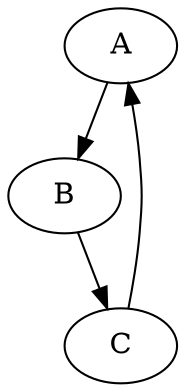
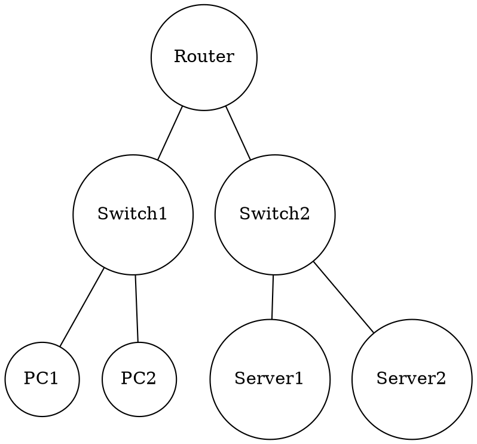
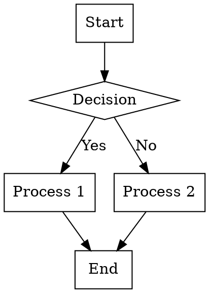

# GraphViz Test - Simple

This is a test to verify that GraphViz is working properly with the new v3.x standalone implementation.

## Simple Graph

## Network Diagram

## Flowchart

If you can see properly rendered diagrams above, GraphViz is working correctly!